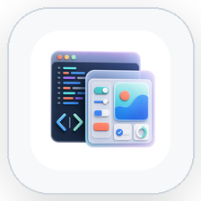
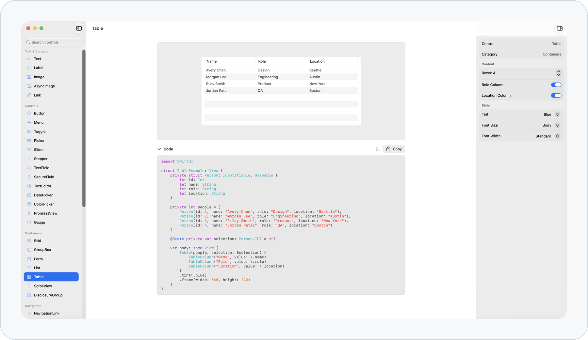

# SwiftUIPreview

<p align="center">
  <picture>
    <source media="(prefers-color-scheme: dark)" srcset="assets/app-icon-dark.png">
    
  </picture>
</p>

SwiftUIPreview is a SwiftUI reference app for exploring common controls and view patterns. Select a control, adjust its options, preview the result, and copy the generated SwiftUI code.

## Features

- Browse SwiftUI examples by category, including text, controls, containers, navigation, presentation, layout, graphics, and advanced views.
- Search the control catalog from the sidebar.
- Preview each control in an interactive surface.
- Adjust control options in the inspector.
- View generated SwiftUI code for the current configuration.
- Copy generated code to the clipboard.
- Show or hide line numbers in the code view.

## Screenshots

<picture>
  <source media="(prefers-color-scheme: dark)" srcset="assets/screenshot-dark.png">
  
</picture>

## Installation

1. Clone the repository.

   ```sh
   git clone https://github.com/zhang-hongshen/SwiftUIPreview.git
   ```

2. Open `SwiftUIPreview.xcodeproj` in Xcode.
3. Select the `SwiftUIPreview` target.
4. Build and run the app.

## Usage

Use the sidebar to browse or search for a SwiftUI control. Select an item to open its preview, then use the inspector to change its options. The code view updates with the selected configuration, and the copy button places the generated SwiftUI code on the clipboard.

## License

SwiftUIPreview is available under the MIT license. See [LICENSE](LICENSE) for details.
